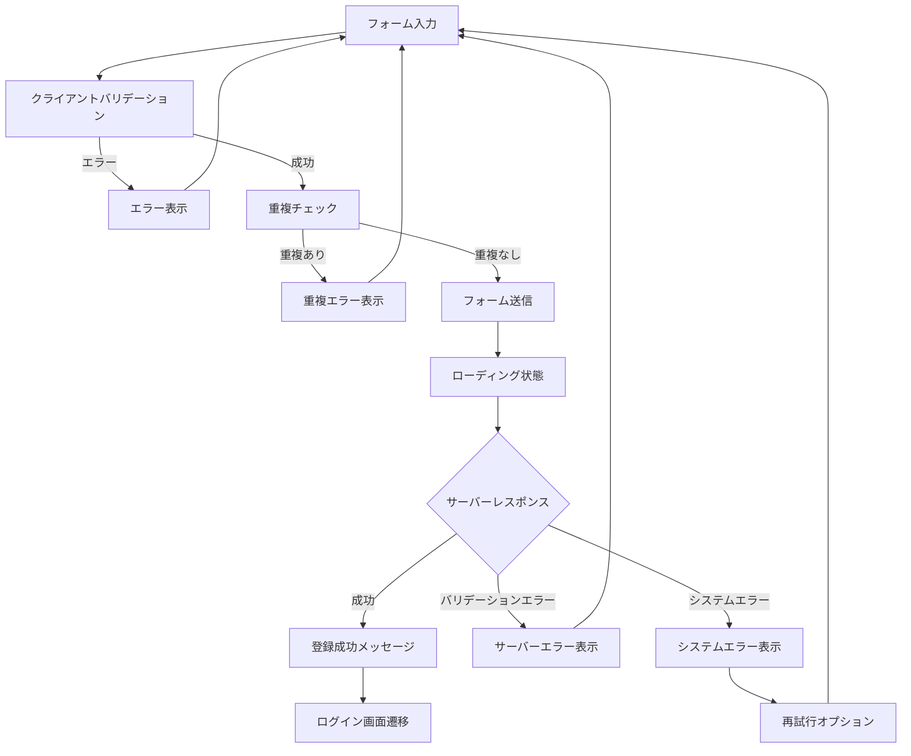

# ユーザー登録画面UIワイヤーフレーム設計書

## メタデータ

| 項目 | 内容 |
|------|------|
| 画面ID | SC-002 |
| 画面名 | ユーザー登録画面 |
| URL | /register |
| 関連UC | UC-001 (新規ユーザー登録) |
| 対象ユーザー | 未登録ユーザー |
| 作成日 | 2025-09-19 |
| バージョン | 1.0 |
| ステータス | ドラフト |

---

## 画面概要

**目的**: 新規ユーザーがシステムに登録するための画面

**機能要件**:

- ユーザー名、メールアドレス、パスワード入力
- パスワード確認入力
- 利用規約同意チェック
- ログイン画面への誘導
- エラーメッセージ表示
- レスポンシブ対応

---

## ワイヤーフレーム設計

### デスクトップ版（1200px以上）

```
┌─────────────────────────────────────────────────────┐
│                   Issue Tracker                     │ ← ロゴ・アプリ名
│                                                     │
│                                                     │
│        ┌─────────────────────────────┐              │
│        │      アカウント作成         │              │ ← カードタイトル
│        │                             │              │
│        │  ユーザー名                │              │
│        │  [_______________]          │              │ ← 入力フィールド
│        │                             │              │
│        │  メールアドレス            │              │
│        │  [_______________]          │              │ ← 入力フィールド
│        │                             │              │
│        │  パスワード                │              │
│        │  [_______________]          │              │ ← 入力フィールド（マスク）
│        │                             │              │
│        │  パスワード（確認）        │              │
│        │  [_______________]          │              │ ← 入力フィールド（マスク）
│        │                             │              │
│        │  □ 利用規約に同意します    │              │ ← チェックボックス
│        │                             │              │
│        │     [アカウント作成]       │              │ ← プライマリボタン
│        │                             │              │
│        │  ─────────────────────      │              │ ← 区切り線
│        │                             │              │
│        │   既にアカウントをお持ちの方│              │
│        │       ログイン             │              │ ← リンク（中央揃え）
│        └─────────────────────────────┘              │
│                                                     │
│                                                     │
│         © 2025 Issue Tracker. All rights reserved.  │ ← フッター
└─────────────────────────────────────────────────────┘
```

### タブレット版（768px-1199px）

```
┌─────────────────────────────┐
│      Issue Tracker         │ ← ロゴ・アプリ名
│                             │
│   ┌───────────────────────┐ │
│   │   アカウント作成      │ │ ← カードタイトル
│   │                       │ │
│   │  ユーザー名          │ │
│   │  [_____________]      │ │
│   │                       │ │
│   │  メールアドレス      │ │
│   │  [_____________]      │ │
│   │                       │ │
│   │  パスワード          │ │
│   │  [_____________]      │ │
│   │                       │ │
│   │  パスワード（確認）  │ │
│   │  [_____________]      │ │
│   │                       │ │
│   │  □ 利用規約に同意    │ │
│   │                       │ │
│   │  [アカウント作成]    │ │
│   │                       │ │
│   │  ─────────────────    │ │
│   │                       │ │
│   │  既にアカウント？    │ │
│   │    ログイン          │ │
│   └───────────────────────┘ │
│                             │
│  © 2025 Issue Tracker.     │
└─────────────────────────────┘
```

### モバイル版（768px未満）

```
┌─────────────────┐
│  Issue Tracker  │ ← ロゴ（小）
│                 │
│ ┌─────────────┐ │
│ │アカウント作成│ │
│ │             │ │
│ │ ユーザー名  │ │
│ │ [_________] │ │
│ │             │ │
│ │ メール      │ │
│ │ [_________] │ │
│ │             │ │
│ │ パスワード  │ │
│ │ [_________] │ │
│ │             │ │
│ │ 確認        │ │
│ │ [_________] │ │
│ │             │ │
│ │□規約に同意 │ │
│ │             │ │
│ │[アカウント作成]│
│ │             │ │
│ │ ───────────  │ │
│ │             │ │
│ │アカウント？ │ │
│ │  ログイン   │ │
│ └─────────────┘ │
│                 │
│ © 2025 Issue    │
│   Tracker       │
└─────────────────┘
```

---

## 要素詳細仕様

### フォーム項目詳細

| フィールド | タイプ | 必須 | バリデーション | プレースホルダー |
|------------|--------|------|---------------|------------------|
| ユーザー名 | text | ○ | 3-30文字、英数字+_ | 例: john_doe |
| メールアドレス | email | ○ | RFC5322準拠 | 例: user@example.com |
| パスワード | password | ○ | 8文字以上、大小英数記号 | 8文字以上で入力 |
| パスワード確認 | password | ○ | パスワードと一致 | 再度入力してください |
| 利用規約同意 | checkbox | ○ | チェック必須 | - |

### バリデーションルール

**ユーザー名**:

- 長さ: 3-30文字
- 文字種: 英数字とアンダースコア（a-zA-Z0-9_）
- 重複チェック: サーバー側で確認

**メールアドレス**:

- 形式: RFC5322準拠
- 重複チェック: サーバー側で確認
- ドメイン存在確認: オプション

**パスワード**:

- 長さ: 8文字以上
- 複雑さ: 大文字、小文字、数字、記号を各1文字以上含む
- 一般的パスワードチェック: NG例は"password", "12345678"

**パスワード確認**:

- パスワードフィールドとの一致確認
- リアルタイムバリデーション

---

## 機能仕様

### フォームバリデーション

**クライアント側バリデーション**:

```javascript
const registrationRules = {
  username: {
    required: true,
    minLength: 3,
    maxLength: 30,
    pattern: /^[a-zA-Z0-9_]+$/,
    asyncCheck: '/api/users/check-username'
  },
  email: {
    required: true,
    email: true,
    asyncCheck: '/api/users/check-email'
  },
  password: {
    required: true,
    minLength: 8,
    complexity: true
  },
  passwordConfirm: {
    required: true,
    equalTo: 'password'
  },
  termsAccepted: {
    required: true
  }
};
```

### パスワード強度表示

**強度レベル**:

| レベル | 条件 | 表示色 | メッセージ |
|--------|------|--------|------------|
| 弱い | 8文字未満 | 赤 | パスワードが短すぎます |
| 普通 | 8文字以上、単純 | オレンジ | より複雑なパスワードを推奨 |
| 強い | 8文字以上、複雑 | 緑 | 安全なパスワードです |

**表示例**:

```
パスワード強度: ████████░░ 強い
```

### エラーメッセージ仕様

| フィールド | エラー条件 | メッセージ |
|------------|------------|------------|
| ユーザー名 | 空欄 | ユーザー名を入力してください |
| ユーザー名 | 短すぎ | ユーザー名は3文字以上で入力してください |
| ユーザー名 | 重複 | このユーザー名は既に使用されています |
| メール | 空欄 | メールアドレスを入力してください |
| メール | 形式エラー | 正しいメールアドレス形式で入力してください |
| メール | 重複 | このメールアドレスは既に登録されています |
| パスワード | 弱い | パスワードは8文字以上で大小英数記号を含めてください |
| パスワード確認 | 不一致 | パスワードが一致しません |
| 利用規約 | 未同意 | 利用規約に同意してください |

### 利用規約モーダル

**モーダル仕様**:

- トリガー: "利用規約"テキストリンク
- サイズ: 大（800px幅）
- スクロール: 内容エリアのみ
- アクション: 同意・キャンセルボタン

---

## レスポンシブ仕様

### ブレークポイント対応

| ブレークポイント | カード幅 | フィールド配置 | ボタン幅 |
|------------------|----------|---------------|----------|
| xs (<576px) | 95vw | 1列（縦積み） | 全幅 |
| sm (576-768px) | 90vw | 1列（縦積み） | 全幅 |
| md (768-992px) | 600px | 1列（縦積み） | 全幅 |
| lg (992px+) | 500px | 1列（縦積み） | 全幅 |

### フィールド間隔調整

| 画面サイズ | フィールド間余白 | ボタン上余白 |
|------------|------------------|---------------|
| モバイル | 1rem | 1.5rem |
| タブレット | 1.25rem | 2rem |
| デスクトップ | 1.5rem | 2rem |

---

## アクセシビリティ仕様

### ARIA属性設定

```html
<form role="form" aria-labelledby="register-title" novalidate>
  <h2 id="register-title" class="sr-only">ユーザー登録フォーム</h2>
  
  <div class="mb-3">
    <label for="username" class="form-label">
      ユーザー名 <span class="text-danger" aria-label="必須">*</span>
    </label>
    <input 
      type="text" 
      class="form-control" 
      id="username"
      name="username"
      aria-required="true"
      aria-describedby="username-help username-error"
      autocomplete="username"
    >
    <div id="username-help" class="form-text">
      3-30文字の英数字とアンダースコア
    </div>
    <div id="username-error" class="invalid-feedback" aria-live="polite"></div>
  </div>
</form>
```

### キーボードナビゲーション

| 順序 | 要素 | 機能 | 説明 |
|------|------|------|------|
| 1 | ユーザー名 | 入力 | 最初のフォーカス |
| 2 | メールアドレス | 入力 | メール形式バリデーション |
| 3 | パスワード | 入力 | 強度表示更新 |
| 4 | パスワード確認 | 入力 | リアルタイム一致確認 |
| 5 | 利用規約 | チェック | スペースキーで切り替え |
| 6 | 利用規約リンク | リンク | モーダル表示 |
| 7 | 登録ボタン | 送信 | Enter で送信実行 |
| 8 | ログインリンク | 遷移 | ログイン画面へ |

---

## 状態管理・動作フロー

### 登録処理フロー



### フォーム状態管理

```javascript
const registrationFormState = {
  fields: {
    username: { value: '', valid: null, error: '' },
    email: { value: '', valid: null, error: '' },
    password: { value: '', valid: null, error: '', strength: 0 },
    passwordConfirm: { value: '', valid: null, error: '' },
    termsAccepted: { value: false, valid: null, error: '' }
  },
  formValid: false,
  isSubmitting: false,
  submitAttempted: false
};
```

---

## デザイン・スタイル仕様

### カラーパレット

| 要素 | 通常時 | フォーカス時 | エラー時 | 成功時 |
|------|--------|-------------|----------|--------|
| 入力フィールド枠線 | #ced4da | #007bff | #dc3545 | #28a745 |
| ラベルテキスト | #212529 | #212529 | #dc3545 | #212529 |
| プレースホルダー | #6c757d | #6c757d | #6c757d | #6c757d |
| ヘルプテキスト | #6c757d | #6c757d | #dc3545 | #28a745 |

### パスワード強度表示

```css
.password-strength {
  margin-top: 0.5rem;
}

.strength-meter {
  height: 4px;
  background: #e9ecef;
  border-radius: 2px;
  overflow: hidden;
}

.strength-fill {
  height: 100%;
  transition: width 0.3s ease, background-color 0.3s ease;
}

.strength-weak { 
  width: 33%; 
  background: #dc3545; 
}

.strength-medium { 
  width: 66%; 
  background: #ffc107; 
}

.strength-strong { 
  width: 100%; 
  background: #28a745; 
}
```

---

## テスト観点

### 機能テスト項目

- [ ] 正常登録処理の完了
- [ ] 各フィールドのバリデーション
- [ ] 重複チェックの動作
- [ ] パスワード強度表示
- [ ] パスワード確認の一致チェック
- [ ] 利用規約モーダル表示
- [ ] エラーメッセージ表示
- [ ] ログイン画面への遷移

### レスポンシブテスト

- [ ] デスクトップでの表示・操作
- [ ] タブレットでの表示・操作
- [ ] モバイルでの表示・操作
- [ ] フィールドの入力しやすさ
- [ ] ボタンのタップ領域サイズ

### アクセシビリティテスト

- [ ] キーボードナビゲーション
- [ ] スクリーンリーダー読み上げ
- [ ] フォーカス表示の明確さ
- [ ] エラー通知の読み上げ
- [ ] 必須項目の明示

---

## 実装技術仕様

### 必要なJavaScriptライブラリ

```javascript
// password-strength.js - パスワード強度チェック
class PasswordStrengthChecker {
  static check(password) {
    let score = 0;
    if (password.length >= 8) score++;
    if (/[a-z]/.test(password)) score++;
    if (/[A-Z]/.test(password)) score++;
    if (/[0-9]/.test(password)) score++;
    if (/[^A-Za-z0-9]/.test(password)) score++;
    return Math.min(score, 3); // 0: weak, 1-2: medium, 3: strong
  }
}

// duplicate-checker.js - 重複チェック
class DuplicateChecker {
  static async checkUsername(username) {
    const response = await fetch('/api/users/check-username', {
      method: 'POST',
      headers: { 'Content-Type': 'application/json' },
      body: JSON.stringify({ username })
    });
    return response.json();
  }
}
```

### CSSカスタマイゼーション

```css
/* 登録フォーム専用スタイル */
.registration-form .form-floating {
  margin-bottom: 1.5rem;
}

.registration-form .form-check {
  margin: 1.5rem 0;
}

.registration-form .password-requirements {
  font-size: 0.875rem;
  color: #6c757d;
  margin-top: 0.5rem;
}

.registration-form .password-requirements .requirement {
  display: block;
}

.registration-form .password-requirements .requirement.met {
  color: #28a745;
}

.registration-form .btn-primary {
  min-height: 48px; /* タッチフレンドリー */
}
```

---

**設計完了**: ユーザー登録画面のワイヤーフレーム設計が完了しました。ログイン画面と統一されたデザインを維持しながら、登録に必要な機能を網羅しています。